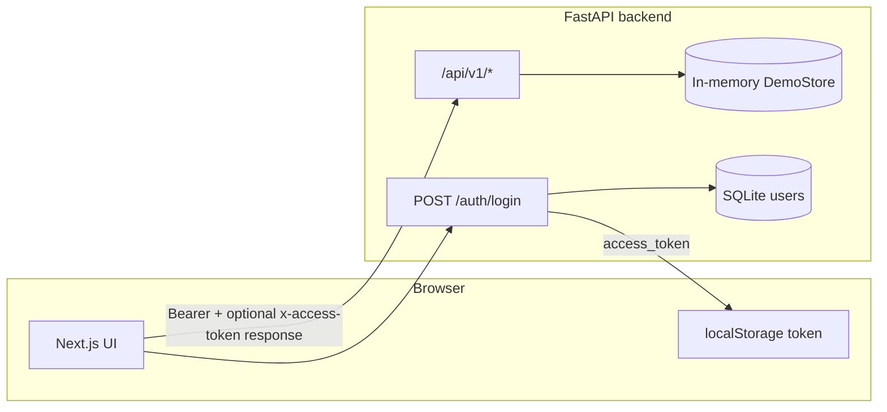

# Futures First — Secure AI Insights Assistant

Full-stack demo of an **internal analytics assistant**: the backend loads **demo CSV and PDF files into memory** at startup (no SQL database for demo analytics), runs tool-augmented LLM chat over that context, and exposes a **versioned REST API** secured with **JWT bearer tokens**. Users sign in against a **SQLite** credential store; an **admin** account (seeded from environment variables) can create additional members.

---

## What’s in this repo

| Area | Stack | Role |
|------|--------|------|
| **Backend** | Python 3.12+, FastAPI, Uvicorn, PyJWT, SQLite (`auth.db`), bcrypt | Email/password login, JWT issuance, demo data loading, embeddings (sentence-transformers by default), LLM calls (Groq or OpenAI) |
| **Frontend** | Next.js 16, React 19, TypeScript, Tailwind, react-markdown | Login gate, chat UI (Markdown answers), authenticated API calls, admin “add user” panel |

---

## Architecture (high level)



- **Auth users** live in SQLite (default path `backend/data/auth.db`, configurable via `AUTH_DB_PATH`). Passwords are stored as bcrypt hashes.
- **Demo analytics data** lives under `backend/demo_data/` (CSVs + `pdfs/`). It is read at startup into `DemoStore`; reloading from disk is available via an authenticated endpoint.
- **Chat** uses an agent/orchestrator layer that plans tools, aggregates CSV-backed analytics and PDF chunks, then calls the configured LLM.

---

## Backend

### Layout

- `backend/app/main.py` — FastAPI app, CORS, JWT rotation middleware, `init_auth_db()` on startup, `POST /auth/login`
- `backend/app/services/auth_sqlite.py` — SQLite schema, admin seed, authenticate, create users
- `backend/app/api/` — API router (`/api/v1`) and route modules (`chat`, `analytics`, `demo`, `docs`, `history`, `health`, `users`)
- `backend/app/core/` — settings (`pydantic-settings`), JWT helpers (`security.py`)
- `backend/app/memory_store.py` — in-memory store and CSV/PDF loading
- `backend/app/agents/` — routing and orchestration for tool use
- `backend/demo_data/` — sample data (copy or generate via `scripts/` if present)

### Configuration

Copy `backend/.env.example` to `backend/.env` and set at least:

- **`JWT_SECRET`** — long random secret used to sign tokens (HS256). Never commit real values.
- **`GROQ_API_KEY`** or **`OPENAI_API_KEY`** — required for chat unless you only need health checks.
- **`FRONTEND_ORIGIN`** — exact browser origin allowed by CORS (e.g. `http://localhost:3000`).

**SQLite login (auth database):**

- **`AUTH_DB_PATH`** — SQLite file path (default `data/auth.db`, relative to backend working directory unless absolute).
- **`ADMIN_EMAIL`** — first-time seed creates this user if no row exists for that email (default in code: `adminlocalhost@gmail.com`; override in `.env`).
- **`ADMIN_PASSWORD`** — password used when inserting the seeded admin (change in production).

After changing admin email/password for an existing database, either delete `data/auth.db` to re-seed, or update the user row manually.

Other notable variables: `JWT_ISSUER`, `JWT_AUDIENCE`, `JWT_TTL_SECONDS`, `DEMO_DATA_DIR`, `EMBEDDING_PROVIDER`, `LLM_PROVIDER`, model IDs, `LOG_LEVEL`. See `backend/.env.example` for the full list.

### How the API is structured

- **Base path for product APIs:** `/api/v1` (see `backend/app/api/router.py`).
- **Public health check:** `GET /api/v1/health` — no bearer token required.
- **Login:** `POST /auth/login` — body `{ "email": "string", "password": "string" }`. Looks up the user in SQLite; returns `{ "access_token": "<jwt>", "token_type": "bearer" }`. JWT `sub` is the email; `scopes` include `admin` and `user` for administrators, otherwise `user`.
- **Admin-only user creation:** `POST /api/v1/users` — body `{ "email", "first_name", "last_name" }`. Creates a member with a generated temporary password returned once in the response.
- **Protected routes** use FastAPI `Depends(get_principal)`, which requires a valid `Authorization: Bearer <jwt>` header and returns a `Principal` (`subject`, `scopes`). Examples: `POST /api/v1/chat`, `POST /api/v1/demo/reload`, analytics routes, docs routes, history stub.

Interactive docs: when the server runs locally, OpenAPI is at `/docs` (FastAPI default).

### JWT implementation (backend)

Implemented in `backend/app/core/security.py`:

- **Algorithm:** HS256 (configurable via `JWT_ALG`).
- **Claims:** `iss`, `aud`, `sub` (subject / email), `scopes`, `iat`, `nbf`, `exp`, `jti` (unique per minted token).
- **Verification:** `jwt.decode` enforces issuer, audience, required claims, and ±60s leeway on time.

**Sliding session / rotation:** `main.py` registers HTTP middleware that, on every response, if the request carried a **valid** bearer token, sets response header **`x-access-token`** to a **newly minted** token for the same principal. Clients should replace their stored token when this header is present so sessions stay fresh without separate refresh endpoints.

---

## Frontend

### Layout

- `frontend/src/app/` — Next.js App Router (`page.tsx`, layouts, styles)
- `frontend/src/components/` — `AppGate` (login vs app shell), `ChatShell`, chat Markdown (`ChatMessageBody`), demo panel, optional `AdminUserPanel` for admins
- `frontend/src/lib/backend.ts` — backend URL, token storage, `login`, `createUser`, `chat`, `authedFetch`, token freshness and scope helpers

### Environment

Set **`NEXT_PUBLIC_BACKEND_BASE_URL`** to the backend’s public URL (no trailing slash required in code, but be consistent with your deployment). Default in `backend.ts` is `http://localhost:8000` if unset.

Create `frontend/.env.local` (not committed) with:

```env
NEXT_PUBLIC_BACKEND_BASE_URL=http://localhost:8000
```

The repo root **`run.ps1`** script updates `NEXT_PUBLIC_BACKEND_BASE_URL` in `.env.local` to match the backend port it uses (default backend port **8001** in the script).

### How login works (frontend ↔ backend)

1. The **login screen** collects email and password and calls **`POST {NEXT_PUBLIC_BACKEND_BASE_URL}/auth/login`**.
2. Backend returns **`access_token`** (JWT). Frontend stores it in **`localStorage`** under key `ff_access_token`.
3. Authenticated requests to **`/api/v1/...`** send **`Authorization: Bearer <token>`**.
4. If the response includes **`x-access-token`**, the client **replaces** the stored token (`backend.ts` does this for chat and `authedFetch`).
5. On **401**, the client **clears** the token so the UI can show the login screen again.
6. On load, the UI uses the JWT payload **without verification** only for UX (`isTokenFresh`, `tokenHasScope`); the backend remains the source of truth for validation.

Admins see **Add user** (email, first name, last name); the API returns a one-time temporary password to share with the new user.

Chat responses are rendered as **Markdown** (headings, lists, bold, etc.) in the assistant bubble.

---

## Running locally

### One-shot script (Windows)

From the repo root:

```powershell
.\run.ps1
```

Optional parameters: `-BackendPort 8001`, `-FrontendPort 3000`, `-BackendHost 127.0.0.1`.

The script ensures `backend/.env` exists, installs backend/frontend dependencies if needed, syncs `frontend/.env.local` to the backend URL, starts **uvicorn** and **`npm run dev`** in separate windows. On Windows, the frontend is launched via **`cmd.exe`** so **`npm.cmd`** resolves correctly.

### Backend (manual)

```powershell
cd e:\Futures-First\backend
python -m venv .venv
.\.venv\Scripts\python -m pip install -r requirements.txt
copy .env.example .env
# Edit .env: JWT_SECRET, ADMIN_*, LLM API key(s), FRONTEND_ORIGIN
.\.venv\Scripts\uvicorn app.main:app --reload --host 127.0.0.1 --port 8000
```

Use the same port in `NEXT_PUBLIC_BACKEND_BASE_URL`.

### Frontend (manual)

```powershell
cd e:\Futures-First\frontend
npm install
# Set NEXT_PUBLIC_BACKEND_BASE_URL in .env.local
npm run dev
```

### Docker

From `docker/`:

```powershell
cd e:\Futures-First\docker
docker compose up --build
```

Compose maps backend to port **8000** and frontend to **3000**, and sets `NEXT_PUBLIC_BACKEND_BASE_URL` for the frontend container. Ensure `backend/.env` exists for secrets.

### Demo data

Place (or generate) files under `backend/demo_data/`:

- CSVs: e.g. `movies.csv`, `viewers.csv`, `watch_activity.csv`, `reviews.csv`, `marketing_spend.csv`, `regional_performance.csv`
- PDFs: `backend/demo_data/pdfs/*.pdf`

**Reload without restart:** `POST /api/v1/demo/reload` (requires a valid JWT).

---

## Data and security

### Data handling

- **Analytics application state:** in-memory `DemoStore` loaded from configured `DEMO_DATA_DIR`. Restart clears it unless you reload from disk via the API.
- **Login accounts:** SQLite file at `AUTH_DB_PATH`. Protect this file on disk in shared environments.
- **Secrets:** LLM keys, `JWT_SECRET`, and `ADMIN_PASSWORD` live only in server environment (e.g. `.env`). The frontend only sees `NEXT_PUBLIC_*` variables (never put secrets in those).
- **Logs:** Request middleware adds/propagates **`x-request-id`** for correlation.

### Security properties (as implemented)

| Topic | Behavior |
|--------|-----------|
| **Authentication** | Email/password against SQLite; bearer JWT on protected routes; `get_principal` returns 401 if missing/invalid. |
| **Authorization** | `POST /api/v1/users` requires JWT with `admin` in `scopes`. |
| **CORS** | `CORSMiddleware` allows a **single** configured origin (`FRONTEND_ORIGIN`), credentials allowed, standard methods/headers; exposes `x-access-token` and `x-request-id`. |
| **Token storage** | Browser `localStorage` — simple for a demo; **vulnerable to XSS**. Production apps often prefer httpOnly cookies (with CSRF protections) or tighter CSP. |
| **Token format** | HS256 symmetric signing — anyone with `JWT_SECRET` can forge tokens; guard the secret and rotate if leaked. |
| **Passwords** | bcrypt hashes in SQLite; default admin is for **development** — use strong `ADMIN_PASSWORD` and proper identity for production. |
| **Transport** | Use **HTTPS** in any shared or production environment; not enforced by application code. |

### Hardening checklist for production

- Integrate your IdP (OAuth2/OIDC, etc.) or enterprise directory instead of bespoke SQLite accounts, or harden SQLite deployment (path, backups, least privilege).
- Use strong `JWT_SECRET`, short `JWT_TTL_SECONDS`, rate-limit login, and monitor for abuse.
- Prefer secure cookies + SameSite and CSRF strategy if moving off SPAs with localStorage.
- Lock down CORS to exact deployment origins; avoid `*` origins with credentials.
- Run behind a reverse proxy with TLS, rate limits, and request size limits.

---

## License / usage

Internal demo project; adjust licensing and deployment practices to match your organization.
